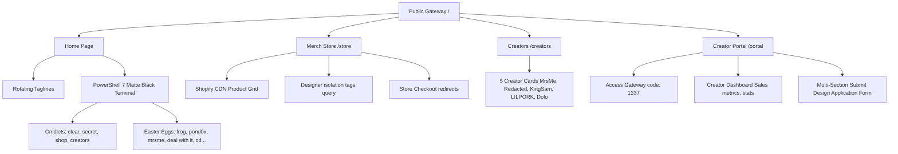

# Memeticexe.com Website Map & Roadmap

This document provides a comprehensive overview of the **Memeticexe.com** store architecture, active routes, component layouts, and planned roadmap items to help focus the next phases of development.

---

## 1. System Architecture Map

---

## 2. Page & Component File Directory

### Public Layer
*   **Home Page (`/`)** — [app/page.js](file:///C:/Users/Aces/.gemini/antigravity/scratch/memetic-store/app/page.js) & [app/page.module.css](file:///C:/Users/Aces/.gemini/antigravity/scratch/memetic-store/app/page.module.css)
    *   *Role*: Dynamic tagline cycles, introductory copy, and primary action routing.
*   **Command Line Terminal Component** — [components/Terminal.js](file:///C:/Users/Aces/.gemini/antigravity/scratch/memetic-store/components/Terminal.js) & [components/Terminal.module.css](file:///C:/Users/Aces/.gemini/antigravity/scratch/memetic-store/components/Terminal.module.css)
    *   *Role*: Legally compliant mock shell prompt (`C:\memetic>`) rendering easter eggs, routing links, cmdlets, window actions, and countdown intervals.
*   **Merch Store (`/store`)** — [app/store/page.js](file:///C:/Users/Aces/.gemini/antigravity/scratch/memetic-store/app/store/page.js)
    *   *Role*: Dynamic collection items, grayscale hover animations, checkout redirects, and creator filtering.
*   **Creators List (`/creators`)** — [app/creators/page.js](file:///C:/Users/Aces/.gemini/antigravity/scratch/memetic-store/app/creators/page.js) & [app/creators/creators.module.css](file:///C:/Users/Aces/.gemini/antigravity/scratch/memetic-store/app/creators/creators.module.css)
    *   *Role*: Grid layout of current creators, server connectivity statuses, and links to filtered merch.

### Protected Portal Layer
*   **Portal Gateway (`/portal`)** — [app/portal/page.js](file:///C:/Users/Aces/.gemini/antigravity/scratch/memetic-store/app/portal/page.js) & [app/portal/portal.module.css](file:///C:/Users/Aces/.gemini/antigravity/scratch/memetic-store/app/portal/portal.module.css)
    *   *Role*: Gate login (code: `1337`), metrics graphs panel, and the multi-section design uploader application.
*   **Submit Redirect (`/submit`)** — [app/submit/page.js](file:///C:/Users/Aces/.gemini/antigravity/scratch/memetic-store/app/submit/page.js)
    *   *Role*: Obsoletes public uploads, redirecting direct traffic to the secure Portal gateway.

---

## 3. Interactive Easter Eggs Reference

| Trigger Action | Input Command / Button | Visual Behavior |
| :--- | :--- | :--- |
| **Pond0x Redirect** | Type `pond0x` | Logs forwarding notification, opens `www.pond0x.com` in new tab. |
| **MrsMe X Redirect** | Type `mrsme` | Logs redirect notification, opens her X profile (`https://x.com/mrsme0x`). |
| **Jumping Frogs** | Type `frog` or `frogs` | Spawns 12 staggered frog emojis (🐸) jumping across viewport. |
| **System Hack Failure** | Type `cd ..` (or generic `cd`) | Shakes terminal violently, displays critical binary error overlay with a 5s countdown, then reboots to normal. |
| **Deal With It Sunglasses** | Type `deal with it` | Drops 8-bit black pixelated sunglasses to screen center, tilts coolly, flashes "DEAL WITH IT", falls off. |
| **Bounce Minimize** | Click terminal `—` button | Bounces the terminal scale down and slides away, before returning to normal after 1.2s. |
| **Bounce Maximize** | Click terminal `⬜` button | Bounces terminal to full screen scale and back. |
| **Vacuum Space Sucking** | Click terminal `✕` button | Implodes the terminal window using a spin-skew vortex effect, then reboots. |

---

## 4. Next Phase Development Options (Roadmap)

To take Memeticexe.com to a production-grade store, we have mapped out three key implementation targets:

### Option A: Stripe Checkout Integration
*   *What it does*: Shift checkout away from external redirects (MerchLabs) to direct payments on Memeticexe.com.
*   *Key components*: Stripe API webhooks, checkout sessions, custom card layouts, and transaction notifications.

### Option B: Database & Persistence Layer (Supabase)
*   *What it does*: Connect the creator portal uploader and analytics dashboards to a real database.
*   *Key components*: Creators schema table, submitted design files storage buckets, and sales metrics database integrations.

### Option C: Stateful Voting Module (`vote.exe`)
*   *What it does*: Port the interactive voting layout from your mockup where users can vote on upcoming merch designs.
*   *Key components*: Session voting limits, active voting polls table, and voting metrics panels.
